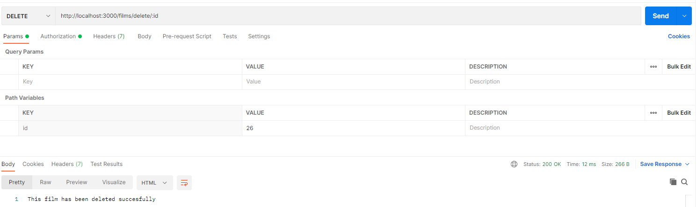

<h1 align="center">
VideoClub
</h1>

___
<h5 align="center">Primer proyecto de Backend realizado en SQL para el Bootcamp FSD de GeeksHubs. Por José Carlos Núñez.</h5>

 

    <a href="#about">About</a> ·
    <a href="#usage">Usage</a> ·
    <a href="#features">Features</a>

___

## About

Simulamos la base de datos de un videoclub, en el que se encuentran tres modelos, peliculas, clientes, y alquiler, relacionados entre ellos mediante alquiler.

He añadido 10 EndPoints con diferentes utilidades en el CRUD de la base de datos.

El FrontEnd ha sido simulado mediante Postman para usar las utilidades de la base de datos.

---

## Usage

El primer Endpoint, nos permite registrar a un nuevo usuario.

 
addUser

El segundo EndPoint, nos permite hacer el login de usuario, el cual nos devolvera un Token, para poder acceder a otras utilidades de la base de datos

 
 login

El tercer EndPoint, ingresando en token recibido en el login, nos permite ver nuestros datos de usuario, salvo al admin, que le permite ver a todos los usuarios.

 
 getUser

El cuarto EndPoint, nos permite modificar los datos de usuario.

 
 updateUser

El quinto EndPoint, nos mostrara todas las peliculas.

 
 getFilms

El sexto Endpoint, nos permite añadir peliculas solo si nuestro token pertenece al admin.

 
 postFilm

El septimo EndPoint, permite al admin eliminar peliculas segun su ID.

 
 deleteFilm

El octavo EndPoint, permite a los usuarios buscar peliculas por el titulo.

 
 searchTittle

El noveno EndPoint, permite a los usuarios realizar un pedido, si el usuario es menor de edad, no podra hacer un pedido de determinadas peliculas.

 
 postRent

El decimo EndPoint, siendo admin, permite ver todos los pedidos realizados.

 
 getRent

---

## Features

         
